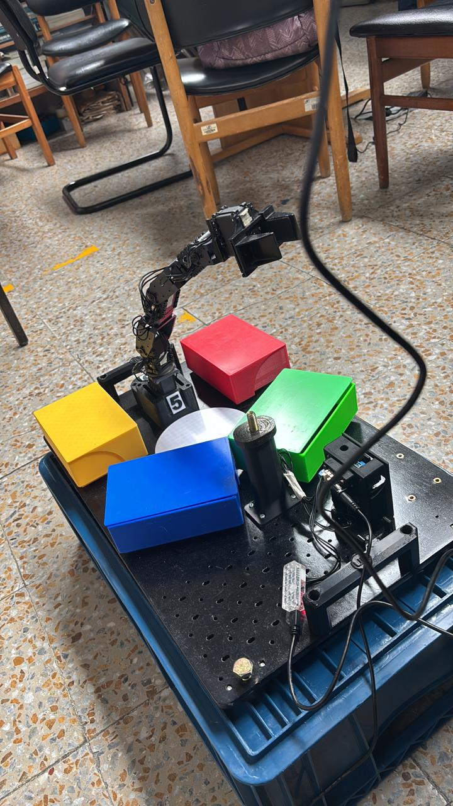
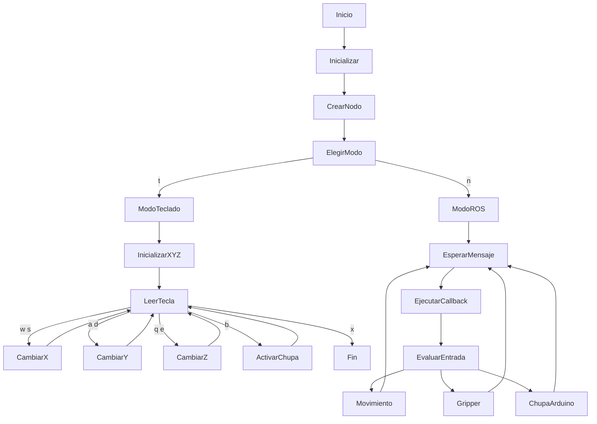
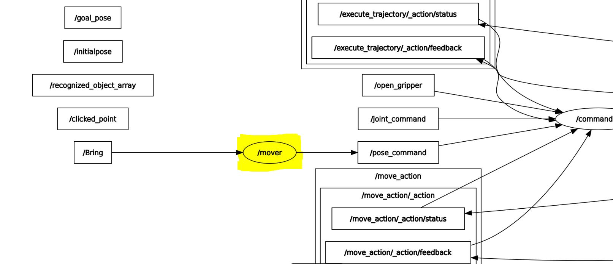

# Proyecto final de robotica 2025-2
Proyecto final de Robótica 2025-2s

# Integrantes
1. Jeison Nicolás Diaz Arciniegas [jediazar@unal.co](JeisonD0819)
2. David Santiago Cuellar Lopez [dacuellarl@unal.edu.co](DavSacl)
3. Brayan Yesid Santos Gonzalez [bsantosg@unal.edu.co](Brayan-Santos-G)
4. Sergio Avellaneda Piñeros [savellaneda@unal.co](savellanedap)

# Informe

Indice:
1. [Objetivos](#objetivos)
2. [Procedimientos realizados](#procedimientos_realizados)
3. [Funcionamiento general y decisiones de diseño](#funcionamiento_y_diseño)
4. [Diagrama de flujo](#diagrama_de_flujo)
5. [Análisis y conclusiones](#conclusiones)

## Objetivos

  

El objetivo principal de este laboratorio es comenzar a aplicar los conceptos de ROS 2 que hemos ido adquiriendo, con el fin de generar trayectorias para el robot Pincher. Además, se ponen en práctica diversos contenidos abordados en la clase magistral, como la cinemática inversa, entre otros temas relevantes.

Adicionalmente, se busca afianzar y profundizar en el uso de las distintas herramientas que ofrece ROS 2, tales como MoveIt, la cual permite visualizar el robot y contar con un gemelo digital. Para llevar a cabo este proceso de manera adecuada y estructurada, y considerando la cantidad de tareas involucradas, se elaboró un diagrama de flujo que permite analizar y comprender la ejecución del script desarrollado.

### Diagrama de flujo

## Procedimientos realizados

Para la primera parte del proyecto, se creó el paquete correspondiente y el script encargado de implementar la lógica del sistema. En nuestro caso, se propuso desarrollar un nodo que sea publisher y listener a la vez. El listener se encarga de escuchar los mensajes publicados, mientras que el publisher publica la información en el tópico definido para esta primera etapa del proyecto, el cual es /pose_command. De esta manera, es posible definir una pose tanto en el robot real como en el robot simulado, utilizando RViz, en la siguiente imagen con la ayuda de nuestra herramienta rqt podremos ver la arquitectura de nuestro nodo, con algunos de los otros nodos.

### Diagrama de arquitectura

Por otro lado, para lograr una visualización completa del sistema y evitar posibles colisiones, fue necesario tener en cuenta el modelado completo del kit Phantom. Durante este proceso se identificó que faltaban algunos elementos, como la ventosa, entre otros componentes, los cuales debían ser incluidos para una representación más precisa del robot. Esta parte se explica de manera detallada en ".xacro"

En cuanto al control de apertura y cierre de la garra, se observó la existencia de un tópico que permitía realizar esta acción. Sin embargo, dicho tópico presentaba algunas limitaciones, por lo que se decidió controlar la garra directamente desde el nodo Pincher Controller. Una vez definido claramente este procedimiento, se procedió a manejar el robot mediante RViz, llevándolo a las trayectorias requeridas, como las necesarias para alcanzar la caja azul, la caja verde u otras ubicaciones. Al alcanzar la pose deseada, se escuchaba el tópico correspondiente para obtener la pose actual del robot y posteriormente publicarla a través de nuestro nodo publisher.

Para la segunda parte del proyecto, se integró un módulo con relé que permitió activar la bomba de aire y, de esta forma, utilizar la ventosa. En este caso, fue necesario realizar nuevamente el proceso de planificación de trayectorias, ya que la incorporación de la ventosa modifica el TCP del robot, haciendo que las trayectorias previamente definidas dejaran de ser válidas.

Finalmente, se requería mover el robot de manera lineal mediante el uso de las teclas, es decir, controlando sus desplazamientos en los ejes X, Y y Z. Para lograr este objetivo, se implementó la cinemática inversa del robot. Una vez obtenida, fue posible controlar el movimiento en el espacio cartesiano de tal forma que, al variar una coordenada (por ejemplo, X), las demás coordenadas se mantienen constantes. Este mismo principio se aplica de manera análoga para los ejes Y y Z.

### .xacro

Para el desarrollo de esta etapa del proyecto se realizó la edición y adaptación de los distintos archivos (`.xacro`) proporcionados como base, los cuales permiten definir de forma paramétrica la estructura mecánica, la geometría y ciertos aspectos del sistema de control del robot PhantomX Pincher. En particular, se trabajó sobre los archivos (`kit.xacro`) y (`phantomx_pincher_arm.xacro`), ya que estos contienen la descripción principal del conjunto del robot y de su brazo manipulador.

Durante este proceso, se modificaron las referencias a los modelos tridimensionales y se incorporaron nuevos archivos de tipo(`.stl`), los cuales fueron ubicados en la carpeta (`/meshes/STL/`). Estos archivos corresponden a las distintas partes físicas del kit (canastilla, soporte de la camara y el gripper neumatico) y son utilizados principalmente para la visualización en el entorno de simulación. Una vez realizadas estas modificaciones, fue posible visualizar correctamente el robot en RViz, confirmando que la estructura cinemática y la jerarquía de enlaces (`links`) y articulaciones (`joints`) estaban definidas de manera adecuada, como se muestra en la siguiente figura.

Con el fin de acercar la simulación al comportamiento del “mundo real”, se procedió a definir las colisiones de cada uno de los componentes del robot. Para ello, se optó por envolver las distintas partes del kit en geometrías simples, principalmente prismas rectangulares (cajas), que aproximan el volumen real de cada componente. Este enfoque permite reducir la complejidad computacional en la simulación, al tiempo que mantiene una representación suficientemente precisa para la detección de colisiones y futuras tareas de planificación de movimiento, como se muestra a continuación.

Durante la implementación de las colisiones se presentó una dificultad particular con el gripper neumático, debido a que su modelado original resultaba demasiado complejo para ser utilizado directamente en la simulación de colisiones (tanto en la etapa se subir los archivos, asi como en su ensamble y su consumo computacional). Esta complejidad podía generar errores en el ensamble de colisiones o afectar el desempeño del sistema. Por esta razón, se decidió simplificar su representación geométrica, manteniendo únicamente un volumen que envolviera el área de trabajo del gripper. De esta manera, se garantizo que las colisiones representen correctamente el espacio ocupado por el efector final durante su operación, como se observa en la figura.

Finalmente, cabe destacar que el uso de archivos (`.xacro`) resulta fundamental para la descripción del robot PhantomX Pincher, ya que permite construir un modelo claro, modular y extensible. La separación entre la estructura mecánica, la geometría visual y los elementos de colisión facilita la incorporación de nuevos componentes, como sensores o herramientas adicionales, así como la adaptación del robot a distintos entornos de simulación y control dentro del ecosistema ROS 2. Este enfoque no solo mejora la organización del modelo, sino que también simplifica su mantenimiento y escalabilidad para futuros desarrollos.

## Planos y elementos utilizados

## Circuito para controlar la bomba

Se diseñó el circuito de tal manera que sea seguro hacer el control del relé, implementando una etapa de potencia aislada que protege al microcontrolador de sobrecargas y picos de tensión.

La conexión no es directa por dos razones físicas fundamentales:

1) Manejo de Corriente (El Transistor): El pin del Arduino solo entrega 20mA, lo cual es insuficiente para energizar la bobina del relé. Por eso, se integro un transistor 2N2222A que funciona como un interruptor de alta ganancia: toma la señal débil del Arduino y habilita el flujo de corriente fuerte necesario para activar el electroimán sin estresar al procesador.

2) Supresión de Transitorios (El Diodo): Para solucionar el problema del 'sobre pico', se coloco un diodo 1N4004 en antiparalelo a la bobina. Físicamente, al desenergizar una carga inductiva como esta, se genera un retorno violento de energía (fuerza contraelectromotriz). El diodo disipa esa energía de forma segura, evitando que ese voltaje inverso retorne y queme los componentes de control.

Posteriormente, se subió un [código](https://github.com/JeisonD0819/Proyecto-Final-Robotica/blob/main/Codigos/Arduino/Arduino.md) al Arduino, el cual permite que con la tecla "b" o "B" el sistema se prenda, y al volverla a oprimir se apague por medio de la señal que envia al pin 8 del Arduino.

## Workspace
Se agrego el workspace completo en la carpeta [phantom_ws](Codigos/phantom_ws/).

## Videos

- Rutina de movimiento del robot para la manipulación y secuencia de los diferentes bloques. [Video](https://youtu.be/xbvq-HY6PJw)  
- Desplazamiento lineal del robot con integración y activación de la bomba de vacío. [Video](https://youtu.be/9mZmh_TL9Yg)  
- Implementación completa de la bomba de vacío durante una rutina de operación (movimiento + succión). [Video](https://youtu.be/OfmL9bQwqx0)  

