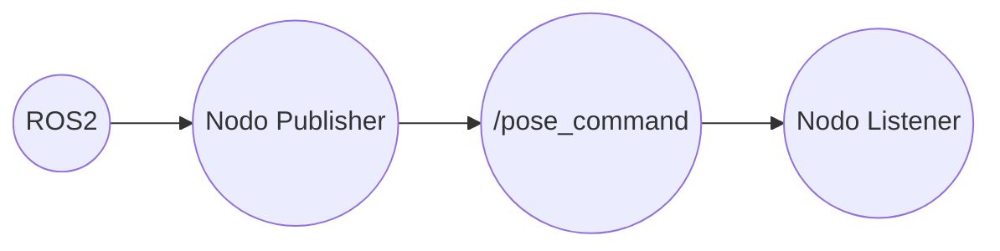

# Proyecto final de robotica 2025-2
Proyecto final de Robótica 2025-2s

# Integrantes
1. Jeison Nicolás Diaz Arciniegas [jediazar@unal.co](JeisonD0819)
2. David Santiago Cuellar Lopez [dacuellarl@unal.edu.co](DavSacl)
3. Brayan Yesid Santos Gonzalez [bsantosg@unal.edu.co](Brayan-Santos-G)
4. Sergio Avellaneda Piñeros [savellaneda@unal.co](savellanedap)

# Informe

Indice:
1. [Objetivos](#objetivos)
2. [Procedimientos realizados](#procedimientos_realizados)
3. [Funcionamiento general y decisiones de diseño](#funcionamiento_y_diseño)
4. [Diagrama de flujo](#diagrama_de_flujo)
5. [Análisis y conclusiones](#conclusiones)

## Objetivos

  

El objetivo principal de este laboratorio es comenzar a aplicar los conceptos de ROS 2 que hemos ido adquiriendo, con el fin de generar trayectorias para el robot Pincher. Además, se ponen en práctica varios contenidos abordados en la clase magistral, como la cinemática inversa, entre otros temas.
Tambien terminar de afianzar y conocer muchas herramientas que nos permite ROS2, herramientas como movit que nos permite visualizar nuestro robot, de tal manera de que tengamos nuestro gemelo digital

## Procedimientos realizados

Para la primera parte del proyecto, se creó el paquete correspondiente y el script encargado de implementar la lógica del sistema. En nuestro caso, se propuso desarrollar un nodo listener y un nodo publisher. El nodo listener se encarga de escuchar los mensajes publicados, mientras que el nodo publisher publica la información en el tópico definido para esta primera etapa del proyecto, el cual es /pose_command. De esta manera, es posible definir una pose tanto en el robot real como en el robot simulado, utilizando RViz.

## Diagrama de arquitectura

Por otro lado, para lograr una visualización completa del sistema y evitar posibles colisiones, fue necesario tener en cuenta el modelado completo del kit Phantom. Durante este proceso se identificó que faltaban algunos elementos, como la ventosa, entre otros componentes, los cuales debían ser incluidos para una representación más precisa del robot.

En cuanto al control de apertura y cierre de la garra, se observó la existencia de un tópico que permitía realizar esta acción. Sin embargo, dicho tópico presentaba algunas limitaciones, por lo que se decidió controlar la garra directamente desde el nodo Pincher Controller. Una vez definido claramente este procedimiento, se procedió a manejar el robot mediante RViz, llevándolo a las trayectorias requeridas, como las necesarias para alcanzar la caja azul, la caja verde u otras ubicaciones. Al alcanzar la pose deseada, se escuchaba el tópico correspondiente para obtener la pose actual del robot y posteriormente publicarla a través de nuestro nodo publisher.

Para la segunda parte del proyecto, se integró un módulo con relé que permitió activar la bomba de aire y, de esta forma, utilizar la ventosa. En este caso, fue necesario realizar nuevamente el proceso de planificación de trayectorias, ya que la incorporación de la ventosa modifica el TCP del robot, haciendo que las trayectorias previamente definidas dejaran de ser válidas.

Finalmente, se requería mover el robot de manera lineal mediante el uso de las teclas, es decir, controlando sus desplazamientos en los ejes X, Y y Z. Para lograr este objetivo, se implementó la cinemática inversa del robot. Una vez obtenida, fue posible controlar el movimiento en el espacio cartesiano de tal forma que, al variar una coordenada (por ejemplo, X), las demás coordenadas se mantienen constantes. Este mismo principio se aplica de manera análoga para los ejes Y y Z.

## Planos y elementos utilizados

## Circuito para controlar la bomba

Se diseñó el circuito de tal manera que sea seguro hacer el control del relé, implementando una etapa de potencia aislada que protege al microcontrolador de sobrecargas y picos de tensión.

La conexión no es directa por dos razones físicas fundamentales:

1) Manejo de Corriente (El Transistor): El pin del Arduino solo entrega 20mA, lo cual es insuficiente para energizar la bobina del relé. Por eso, se integro un transistor 2N2222A que funciona como un interruptor de alta ganancia: toma la señal débil del Arduino y habilita el flujo de corriente fuerte necesario para activar el electroimán sin estresar al procesador.

2) Supresión de Transitorios (El Diodo): Para solucionar el problema del 'sobre pico', se coloco un diodo 1N4004 en antiparalelo a la bobina. Físicamente, al desenergizar una carga inductiva como esta, se genera un retorno violento de energía (fuerza contraelectromotriz). El diodo disipa esa energía de forma segura, evitando que ese voltaje inverso retorne y queme los componentes de control.

Posteriormente, se subió un [código](https://github.com/JeisonD0819/Proyecto-Final-Robotica/blob/main/Codigos/Arduino/Arduino.md) al Arduino, el cual permite que con la tecla "b" o "B" el sistema se prenda, y al volverla a oprimir se apague por medio de la señal que envia al pin 8 del Arduino.

## Evidencia

## Análisis y conclusiones

